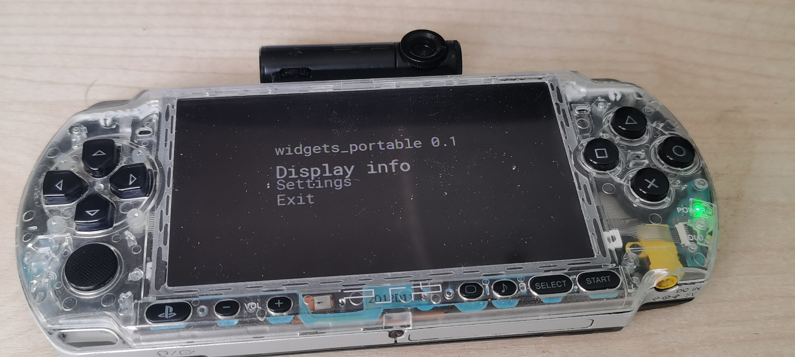

# portable_widgets

### [english readme version / английская версия readme](./README.md)

### PSP приложение для отображения виджетов на ПК (например, раскладка клавиатуры, CPU, GPU, RAM)

# desktop-client

desktop-client доступен по ссылке [https://github.com/entitybtw/widgets_portable-client](https://github.com/entitybtw/widgets_portable-client)

# 👏 спасибо

### - **Antim** — за базовый код меню
